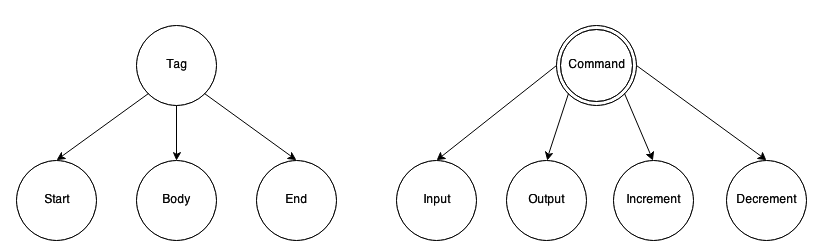
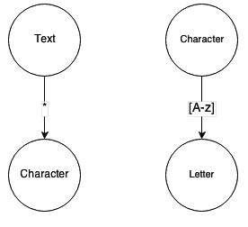
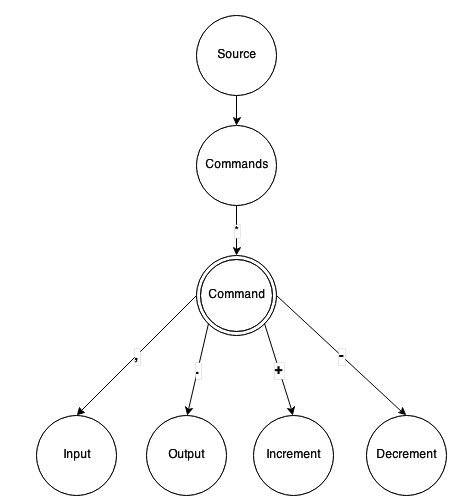
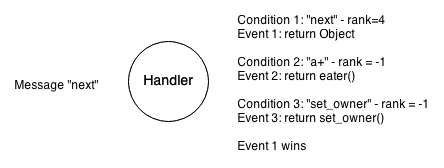

Key Concepts
============
The idea behind Graph-talk is that the simplest and most pleasant way to solve information processing tasks is to represent them in a human-friendly format.

Very frequently, information structure is represented as a graph – a set of vertexes connected by arcs. Vertexes usually denote the notions or states of the system and arcs represent relations between them or conditions for state transitions.

Such a form makes complex things easier to understand than a text description (a picture is worth a thousand words) although the graph representation is often less compact compared to a text one. Aside from the benefits of intuition, the graph model has other advantages and therefore was selected to represent the structure of information or its processing in Graph-talk.

The Graph
---------
The graph consists of Notions connected via Relations.

Notions could be simple (like a leaf in tree structures) or complex (consisting of one or more other notions). The most useful simple notion is an Action notion that could execute some custom code when reached. A complex notion is similar to the AND boolean condition: it consists of several related sub-notions. A sub-type of the complex notion is a Selective notion that is similar to the ANY condition or "switch" statement in programming languages like C++ or Java.

The relation connects notions. The notion it goes from is called the subject, and the notion it goes to is called the object. The relation can also set certain conditions that should be satisfied in order to pass from the subject to the object. A notable relation is the loop relation, which causes the subject notion to consist of more than one similar objects (for example, the string contains zero or more characters). A loop relation is similar to the "for" cycle in programming languages.

Each element belongs to a certain graph. The graph itself has a single root notion that is connected with other notions through different kinds of relations. The graph can contain sub-graphs via their root notions as well.

In the picture above, "Source" consists of "Commands." Each "Command" could be an "Input", "Output", "Increment", "Decrement", etc.

An interesting "side effect" of using graphs to describe processing workflow compared with functions in programming languages is that graphs allow building stackless recursions.

Another possibility is to assemble the graph on the fly to represent dynamic data.

The Talk
--------
Now, let's say there is a graph representing the interpreter of a simple programming language (like Brainfuck_). Besides the graph, we need somehow to process its structure: walk it doing appropriate actions. Such entity is called, easy to guess, a Process.

Process goes from an element to element basing on their type and doing the corresponding actions. How does it do it? It asks each element what to do next, and the element replies on this what should happen. As an example, for generic Relation it sounds like "- What's next? - The Object". For Complex notion, the reply is "Try these relations".

.. figure::  images/concepts_rel.png

So, from a high-level perspective, process sends the message to an element. The element, in turn, replies with other message that is analyzed by the process, pretty much like people talk with each other. But when people talk they say "How was that book?" not "How was that book you bought a few days ago in the antique store in Siena, Italy". The reply depends on the context, or the state of the element.

In Graph-talk each question, or message, goes along with the context.
Python provides a very natural language construct for this: ``__call__``. The base class for all other objects is called the Abstract and has only one method ``__call__(*message, **context)``. The context contains some valuable information about the system state.

Imagine the loop relation with the condition: the Object must appear 5 times. The process-loop dialogue sounds like: P: "What's next? You've already been there 4 times," L: "Let's do it one more time, and increase the iteration counter." There are two conclusions from this: the process is the container for the context, and the state of an element actually depends on the process it talks to.

.. figure::  images/concepts_loop.png

One may ask: why not keep the counter inside the loop itself? Or say: the context soon will be overloaded! Or: someone evil can spoil the state of the other element! Keeping the state out of the elements allows not only the simultaneous processing of one graph by several processes or easily resetting the states when you need to run another round of processing. It also allows you to do a "lookahead," when you want to try several directions within the graph, but are not sure what exactly will work. If something fails, context allows you to return to the previous state and try a different path.

Regarding overloading the context and access violation, an element is able to say not just "remember this" but "let's forget about it," thus resetting its state. And, of course, if data is private, no one except its owner will see it.

The "-" (or the correspondence)
-------------------------------
How is the graph element able to understand the process messages, after all? This is done by a condition-event mechanism. The condition means a condition for the event to appear; the event is an action to run if the condition is true. For example, the relation replies to the "next" message using the condition–event pair, where condition equals "next" and event is "return object".

Condition is basically a value or a function that checks the message, the context, and the state of the object it belongs to and returns one or two values: the rank and the result.

The rank means the relevance of the condition. For example, if the condition were "next" and the message were "next", it would return the length of "next" or 4.

The result is the outcome of the condition. For example, if the condition were the regular expression "a+", the result would be an actual value of regular expression match.

Both the graph element and the process have the same parent class, called Handler, that implements the condition-event mechanism to generate replies to messages. It has a handle method that walks through all conditions and finds the one with the highest rank – similar to the way that Lex works.

Conditions could be strings, lists (in this case, each element of the list is a nested condition and is checked independently), values (like numbers or logical values), and regular expressions, but of course, the most useful type is a custom function. The condition could be an abstract as well – this is how selective notion chooses the best way to go.

If the condition is satisfied (if several conditions have equal rank – the first one is satisfied), the event code is called. The event could be just a value or custom function as well. In the latter case, the context includes the result of the condition.

The Application
---------------
Problem solving using GraphTalk consists of 2 phases:

1. Build the graph model of the algorithm by using the appropriate types of notions and relations.
2. Add to the graph elements corresponding conditions and events.

It is unlikely that the custom type of the process or the element will be required.  Most of the customization involves writing conditions and events.

As soon as the model is ready, it is time to test it. It is possible to use any element as a starting point of the process to test a certain sub-graph. There is also a special debugger for graphs included in the library.

.. _Brainfuck: http://en.wikipedia.org/wiki/Brainfuck