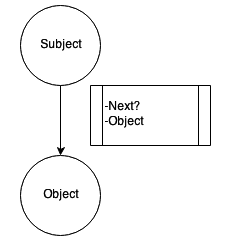
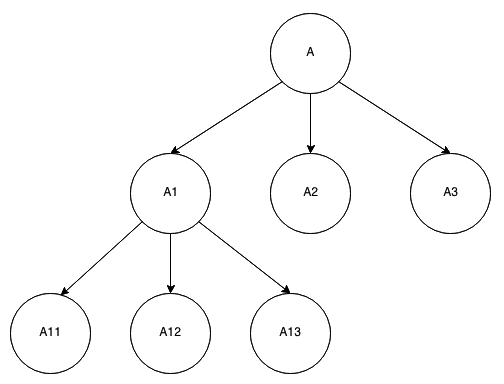
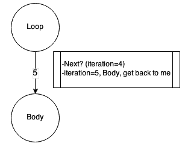
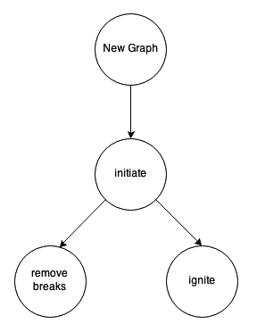
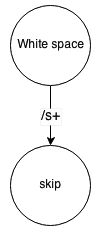
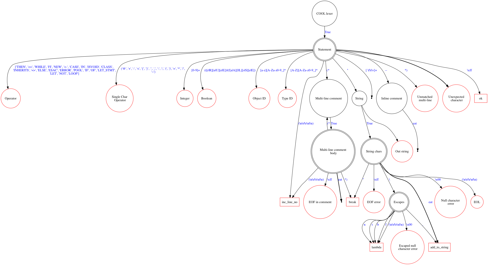

Developer's Guide
*****************
The base of the class hierarchy is :class:`.Abstract` class that does nothing except providing the :meth:`.Abstract.__call__` interface with 'message' and 'context' parameters::

    def __call__(self, *message, **context):
        raise NotImplementedError('Method not implemented')

The communication between objects should use only this method for message exchange::

    a = AbstractImpl()
    a('ultimate question', mode=42)

Message Handling
================

:class:`.Handler` class is a base class for condition-event based message processing. It contains the list of condition-event pairs and uses the :meth:`.Handler.handle` method to find the best condition for the message in a certain context and return the result of the event's call for that condition. The condition and event could be objects, values, or user functions.

To add a new condition-event pair, the Handler class provides an :meth:`.Handler.on` method::

    def on(self, condition, event, *tags)

For example::

    h = Handler()
    h.on('event', lambda: True)

    print h('event')

    > True

    print h('tneve')

    > False

An optional :attr:`.Handler.tags` parameter binds the condition to the state of the handler and will be described later.

When called, the 'on' method converts condition and event parameters to :class:`.Condition` and :class:`.Event` wrapper classes and puts the pair into the Handler event list.

Condition Class
---------------

Condition is processed based on its type – a string, regular expression, user function, etc. This is done by the :meth:`.Condition.setup` method of the :class:`.Condition` class, which sets up the correct :meth:`.Condition.check` function to analyze the message and compare it with the condition value. One may ask why in dynamic typed language, there is a need to worry about types. The reason is very simple: speed. It is too expensive to call non-applicable checks and/or use try blocks each time when looking for the best condition – using a type-specific comparison gives a very significant performance boost.

The default declaration of the user function to be used as a condition has the same form as the :meth:`.Abstract.__call__` method. When checking, it receives data from the :meth:`.Handler.handle` method. For example::

    user_condition = lambda *message, **context: return message and message[0] == "hi"

The result of the condition check is one or two values: check rank and check result. Check rank is a relevance indicator for the condition and the check result is actually the outcome of the check. For example, the check rank of "a+" regular expression for the message "aa" is 2 and the check result is "aa".

=================================   ====================================================
**Check result**                    **Meaning**
---------------------------------   ----------------------------------------------------
One numeric value                   Check rank, Check result will be equal to check rank
Two values: numeric and arbitrary   Check rank is first and Check result is second
One boolean value                   Rank = 0 if True, -1 if False, Check result = value
=================================   ====================================================

Logical checks have 0 rank by default. Check result is useful for the event and will be included in the context during the event's call. For example, if the condition returns True, the event context will contain ``{'rank': 0, 'condition': True}``.

If the condition did not work, it returns (-1, False) or :attr:`.Condition.NO_CHECK` value.

The condition has an ignore_case option, which is False by default. It affects only string conditions.

Let's see how different types of conditions work, always for message[0].

+------------------------------+-----------------------------------------------+-------------------------------------+
| Condition type               | Rank and result                               | Example                             |
+==============================+===============================================+=====================================+
| Function                     | Should return the check rank or check rank    || ``lambda *m, **c: (1,"ok")``       |
|                              | with the check result                         || any message[0]                     |
|                              |                                               ||                                    |
|                              |                                               || rank = 1,                          |
|                              |                                               || check result = "ok"                |
+------------------------------+-----------------------------------------------+-------------------------------------+
| Regular expression - match   | Length of the expression matched and match    || 'a+'                               |
|                              | result                                        || message[0] = "aa"                  |
|                              |                                               ||                                    |
|                              |                                               || rank = 2                           |
|                              |                                               || check result = "aa"                |
+------------------------------+-----------------------------------------------+-------------------------------------+
| Regular expression - search  | Same as above, but using the search method    || "b+"                               |
|                              |                                               || message[0] = "agabb"               |
|                              |                                               ||                                    |
|                              |                                               || rank = 5                           |
|                              |                                               || check result = "bb"                |
+------------------------------+-----------------------------------------------+-------------------------------------+
| String – match               | Length of the string if message[0] starts     || "stop"                             |
|                              | from the string and string itself as a result || message[0] = "stop"                |
|                              |                                               ||                                    |
|                              |                                               || rank = 4                           |
|                              |                                               || check result = "stop"              |
+------------------------------+-----------------------------------------------+-------------------------------------+
| String – search              | Same as above, but using the find method of   || "run"                              |
|                              | string class                                  || message[0] = "now run"             |
|                              |                                               ||                                    |
|                              |                                               || rank = 7                           |
|                              |                                               || check result = "run"               |
+------------------------------+-----------------------------------------------+-------------------------------------+
| Boolean value                | 0, True if message[0] equals value            || False                              |
|                              |                                               || message[0] = False                 |
|                              |                                               ||                                    |
|                              |                                               || rank = 0                           |
|                              |                                               || check result = False               |
+------------------------------+-----------------------------------------------+-------------------------------------+
| List                         | Highest rank for each list item check         || ["1", "11"]                        |
|                              |                                               || message[0] = "11"                  |
|                              |                                               ||                                    |
|                              |                                               || rank = 2                           |
|                              |                                               || check result = "11"                |
+------------------------------+-----------------------------------------------+-------------------------------------+
| Other value                  | 0 or value length if applicable, message[0]   || 8                                  |
|                              | as the result                                 || message[0] = 8                     |
|                              |                                               ||                                    |
|                              |                                               || rank = 0                           |
|                              |                                               || check result = 8                   |
+------------------------------+-----------------------------------------------+-------------------------------------+

For example::

    h = Handler()

    def show_me(*m, **c):
        print c

        return

    h.on(re.compile('a+'), show_me)

    h('aaa')

    > {'sender': <gt.core.Handler object at xxx>, 'condition': 'aaa', 'rank': 3, 'event': <function show_me at xxx>}

Here you see the context content for the event. It contains 'h' object as a sender of the message, passed condition, its rank, and show_me as a selected event. More information on events is below.

There is one more very important benefit from the wrapper classes called context mapping.

Context mapping
---------------

If the condition function or event function always uses declarations like::

    def handler1(*message, **context)

the most frequent operation within such functions will be::

    if context.get('param', 'default'):
        ...

To save the developer's time, Graph-talk implements its so-called "context mapping" feature. If you need to analyze only certain values from the context, you just need to specify their names in the condition or event parameter list. So, the previous example will look like this::

    def handler1 (param='default')

If the context contains 'param' value, it will be used when calling the user function. The table below describes possible context mapping cases.

=================================   =========================================
**Function declaration**            **Call result**
---------------------------------   -----------------------------------------
``handler (*message)``	            Only the message parameter will be filled
``handler (**context)``	            Only the context parameter will be filled
``handler ()``	                    No parameters
``handler (a, b=1)``	            Corresponding parameters will be pulled from the context, default will be used if there is no such key
``handler (*message, **context)``   Default call, both parameters will be filled
non-callable value	                The value will be returned
=================================   =========================================

Usually, condition functions only accept the message to check for message[0] contents. For example, the show_me function in the previous example could be declared as::

    def show_me(**c)

The class that implements the context mapping is called :class:`.Access` and is used as a base class for :class:`.Condition` and :class:`.Event` classes. Access, in turn, is a child of the :class:`.Abstract` class.

Event Class
-----------
:class:`.Event` functions can declare any arguments or do not declare them at all. If the condition was satisfied, the condition check result will be included in the context of the event call::

    h = Handler()
    h.on("continue", do_continue)
    
    def do_continue(**context):
        ...

Event context will contain the following parameters with corresponding values:

#. :attr:`.Handler.RANK` = len("continue"), 8 in this case
#. :attr:`.Handler.CONDITION` = "continue"
#. :attr:`.Handler.EVENT` = do_continue
#. :attr:`.Handler.SENDER` = h

A special feature of Event class is :attr:`.Event.pre` and :attr:`.Event.post` properties, which can contain other events to be called before or after user function. If the pre- or post-event will return a non-empty result, this result will be used instead of the one returned by user function. For example::

    c = Condition(re.compile('a+'))
    e = Event(show_me)
    h.on_access(c, e)  # No need to wrap

    e.pre = 1

    print (h('a'))

    > 1

Pre and post properties accept any functions, which will be wrapped in the Event class and executed via the :meth:`.Event.run` method. If you want to use the Event instance as a pre/post-event, write it directly to :attr:`.Event.pre_event` or :attr:`.Event.post_event` field.

Note that if the post-event was specified, the :attr:`.Event.RESULT` context value for its call will contain the value returned by the user event function.

Handling step-by-step
---------------------

#. Define conditions and events for the handler instance using the arguments needed for checking the condition and running the event.
#. Add the condition and event via the :meth:`.Handler.on` method or via :meth:`.Handler.on_access` if you want to add :class:`.Condition` and :class:`.Event` instances.
#. :class:`.Handler` will try each condition against the incoming message and context to find the one with the highest rank. If several conditions return the same value, the first one will be used.
#. The event of the winning condition will be called, and its result will be returned from the handle method as a tuple (event_result, condition_rank, event_found).
#. If there is no condition found, the handle will return :attr:`.Handler.NO_HANDLE`. There is a way to handle all unknown messages: the Handler class provides the :attr:`.Handler.unknown_event` property, which will be called if no condition worked. Its result will be returned from the handle method.
#. By default, the __call__ method of Handler returns only the event_result value, no condition rank and so on.
#. If the :attr:`.Handler.ANSWER` context value was set to :attr:`.Handler.RANK`, __call__ would return (event_result, rank) tuple: ``a("ultimate question", mode=42, answer=Handler.RANK)``. This will be used by Selective notions.

Some examples (the code from the previous example was used) are the following::

    h.handle(['aa'], {})

    > (1, 2, 1)

    h.handle([], {})

    > (False, -1, None)

Tags
----
The :class:`.Handler` class provides a simple 'state-like' condition filter to avoid unnecessary checks. You can specify a set of tags for the condition in the :meth:`.Handler.on` method to reflect for which state it is applicable::

    h.on("move", do_move, "has_fuel", "has_direction")

The Handler instance has the set of current tags, which reflect its current state and :meth:`.Handler.update` method. Update does a very simple thing: it keeps in the condition-event pair list used by handle method only the conditions which tag set is a subset of the handler tag set.

First, update calls the :meth:`.Handler.update_tags` method. It returns the set of tags describing the current situation. If it is different from the existing set, update filters the list of active conditions and events.

If tags are {"has_fuel", "maps_loading"}, the "move" message will not be considered at all. If tags are {"has_fuel", "has_direction", "doors_closed"} – the "move" condition-event pair will be active.

For example::

    class UpdateTest(Handler):
        def __init__(self):
            super(UpdateTest, self).__init__()
            self.fixed_tags = set()

        def update_tags(self):
            return self.fixed_tags

    u = UpdateTest()

    u.on('move', Event(True), 'has_fuel', 'has_direction')

    print u('move')

    > False

    u.fixed_tags = {'has_fuel', 'maps_loading'}
    u.update()

    print u('move')

    > False

    u.fixed_tags = {'has_fuel', 'has_direction', 'doors_closed'}
    u.update()

    print u('move')

    > True

The :meth:`.Handler.update` method should be executed manually in appropriate cases. Use the :attr:`.Handler.tags` field to access the current tags.

Building and Walking the Graphs
===============================

The graph is a set of Notions and Relations. It has a root notion whose name is also the name of the graph. Both notions and relations have the same parent class: :class:`.Element`. The parent class of the :class:`.Element` class is the :class:`.Handler`.

Graph Element
-------------
As mentioned above, the process asks the element what to do next. That means sending the corresponding message to it. For the "forward" direction, the message is "next" (defined as :attr:`.Process.NEXT`); for the backward direction, the messages are "previous" (defined as :attr:`.Process.PREVIOUS`), "break" (defined as :attr:`.ParsingProcess.BREAK`), "continue" (defined as :attr:`.ParsingProcess.CONTINUE`), and "error" (defined as :attr:`.ParsingProcess.ERROR`).

The Element class uses the Handler's features to respond to process messages. It has two convenience methods: :meth:`.Element.on_forward` and :meth:`.Element.on_backward` to assign customized events to reply to the process.

As an example, :class:`.ActionNotion` uses the 'on_forward' event to specify the user function to be triggered when the process passes the notion.

Each Element belongs to a certain graph, which is set by the :attr:`.Element.owner` property. When the owner changes, Element sends the "set_owner" message to the old and new owners so they can update their internal references.

Walking the Graph
-----------------

Different elements respond differently to the :attr:`.Process.NEXT` process message.

Basic :class:`.Notion` is a leaf of the tree ("Object" in the figure below), so it does not return the next element. :class:`.ActionNotion` could trigger a user function to do something when reaching this notion.

Basic :class:`.Relation` (an arrow in the figure above) does not reply to process messages – it just connects two elements together (subject and object). :class:`.NextRelation` replies with the :attr:`.Relation.object` to the :attr:`.Process.NEXT` message, thus providing a way to pass itself forward, from the top to the bottom of the graph. It also has the :attr:`.NextRelation.condition` to be checked before replying. If the condition is specified and False, the relation will not be passable. :class:`.ActionRelation` is similar to ActionNotion – it triggers a user function when passed.

:class:`.ComplexNotion` consists of other notions and implies the presence of all of them. It returns not just one relation but the whole "to-pass list." Some of those relations could lead to another complex notion. To support this, the process has a list of elements to visit, implemented as a queue.

For example, complex notion "A" contains "A1, A2, A3" notions; "A1" is a complex notion too and contains "A11, A12, A13" notions. The process receives ["A-A1", "A-A2", "A-A3"] list of relations from "A." When process visits "A1" and pops the first element, it receives ["A1-A11", "A1-A12", "A1-A13"]. The "to-pass" list will look like this: ["A1-A11", "A1-A12", "A1-A13", "A-A2", "A-A3"]. The process always works with the head of the queue; it takes commands/elements from it and puts back the replies from the elements.

:class:`.SelectiveNotion` is a kind of complex notion that finds the best relation to pass in the current context. It checks all of its sub-relations for the highest relevance rank and returns the best one to the process. Here, the trick is that several relations could return the same rank.

.. figure::  images/guide_selective.png

For example, selective notion "B" contains "B1, B2" notions via NextRelations without conditions. That means both "B-B1" and "B-B2" will have the same rank equal to zero. The final decision of which case is good is yet to be revealed somewhere later. So, the process needs to try both relations. If the first one fails, we will need to revert all changes to the initial state when we've made the decision to try "B-B1" and "B-B2". This is a general approach called lookahead. With lookahead, you try one case, and if it does not work, you try another one.

Lookahead and Error Handling
----------------------------
Each time the element makes a decision about how it should reply to the process, it considers only the message and the context. This is a very important assumption because if we ask the same thing in the same context, the result should be the same as well. Imagine that we took a wrong turn at the selective notion and several elements later found that we could not move further. What if the context had already changed? If we had had an original context state, we could have just returned to the initial point and could have tried another case (or cases)—pretty much like transactions work. This is how it works in Graph-talk, step by step:

#. The selective notion finds that there is more than one relation to try.
#. That means we need to keep the original context. This is done via a "push_context" (defined as :attr:`.StackingProcess.PUSH_CONTEXT`) message to the process. The process creates a restore point for the future and puts it to the stack.
#. Besides :attr:`.StackingProcess.PUSH_CONTEXT`, selective notion returns the first case (first relation) to try and the reference to itself to talk again later.
#. Process picks the first case and talks to it, moving forward while possible.
#. If an error is encountered (some element returned an :attr:`.ParsingProcess.ERROR` message), the process reverses its direction and starts to ask elements with not the :attr:`.Process.NEXT` but the :attr:`.ParsingProcess.ERROR` question. Elements stop to answer, and this question will finally go to the initial selective notion.
#. If the case worked fine, the process would go to selective notion as well, but without an error.
#. When selective notion is visited again with an error, it restores the context (via :attr:`.StackingProcess.POP_CONTEXT` command) and tries another case, changing the direction of the process to forward again (step 2).
#. If there was no error, selective notion just discards the stored context because it is not needed anymore (:attr:`.StackingProcess.FORGET_CONTEXT` command).

Lookahead looks a bit similar to the exception handling. The only difference is that the process does not really go back – it just changes its message. It starts asking "error" to each element in its "to-pass" list, starting from the current one until some element will handle it. If there were several nested selective notions, they would pop the saved contexts from the stack one by one. If no case worked, the "error" message would go to the higher level, and the process finishes.

If an element keeps and changes its state out of the context, it means its state cannot and will not be reverted. There is a way to store the state conveniently within the context – it will be described later.

Context and State
-----------------
The context could be used for information exchange between the elements. For example, an element may put there some data, which will be used by another element. To handle this, the following messages are used: "add_context" (defined as :attr:`.SharedProcess.ADD_CONTEXT`), "update_context" (defined as :attr:`.SharedProcess.UPDATE_CONTEXT`) and "delete_context" (defined as :attr:`.SharedProcess.DELETE_CONTEXT`). For example, an ActionRelation may say to the process, "add_context": {"warning": "under_construction"}, and another ActionRelation could use it in the handler via context mapping::

    def is_safe_road(warning):
        return None if warning else self.object

If there is a need to roll back during lookahead, all the changes in the context done through these commands will be reverted – just as the undo operation works.

If the element needs to keep in the context some private information that should not be shared but be a part of the rollback, there is a pair of commands to do this: "set_state" (defined as :attr:`.StatefulProcess.SET_STATE`) and "clear_state" (defined as :attr:`.StatefulProcess.CLEAR_STATE`). First, one will set the specified value as a state for the current element. When this element is visited, its state will be sent to it as part of the context in the :attr:`.StatefulProcess.STATE` value. No other element will see this state. If the state is not needed anymore, just clear it.

For example, the complete selective notion reply for lookahead looks like this, given that the "case" is the first relation to try, and "cases" is the list of all other relations with the same rank: ["push_context", {"set_state": {"cases": cases}}, case, self].

The state will be sent as part of the context, so context mapping could be used to handle it as well. Note that if the state is a complex value like a dictionary, its content will not be reverted. Only the top-level value will be rolled back. An example of how the state works for loops is below.

Looping
-------
Let's say that some complex notion should appear exactly N times. This is what :class:`.LoopRelation` does. It repeats its object according to the condition specified. Here are the supported conditions:

#. Integer N
#. Ranges M, N (from M to N); M, ... (at least M and more); ..., N (0 to N).
#. Wildcards: "*" (from 0 to an infinite number of times), "?" (0 or 1 time), "+" (more than one time)
#. User function
#. TRUE_CONDITION (infinite loop)

Loop uses both state and lookahead. In the simplest case, it says to the process, "set my state to the number of iteration, then take the object, and come back to me after all." When the process comes back to the loop again (note – it still is a forward direction), it checks the iteration number; if it is within the bounds, it repeats the cycle with an iteration of + 1.

If there is a :meth:`.LoopRelation.is_flexible` (without an exact number of repetitions) condition used, like "*", it works in a bit of a different manner. We do not know how many times the Object should appear, so the loop says, "push the context, then go to the object, and come back to me." If there was no error – fine, at least one iteration worked. However, there may be more Objects, so we need to iterate again, now with a different context – the one we have now. The old context is discarded, and a new one is put to the stack. Reusing the transaction analogy, try several payments: if the first one works, update the balance, and try another one.

If an error occurs and conditions were satisfied, the loop restores the last-known good context and ends, changing the direction of the process to forward again. Otherwise, it clears the state and keeps the error propagating further.

Loops could handle :attr:`.ParsingProcess.CONTINUE` and :attr:`.ParsingProcess.BREAK` messages as most programming languages do. If the element says "break," the process changes its question from "next" to "break" and keeps going until it finds someone who can handle it. First, the loop consumes it and does the appropriate handling, stopping the iterations and clearing the state. It also changes the direction to forward.

Building the Graphs
-------------------
:class:`.GraphBuilder` is the class to construct graphs. It allows chained operations, so the building process looks like this::

    builder = GraphBuilder('New Graph')

    builder.next_rel().complex('initiate').next_rel().notion('remove breaks').back().back().next_rel().act('ignite', 1)

    print Process()(builder.graph)

    > 1

This is the graph: 

The builder has used the :attr:`.GraphBuilder.current` element to attach the result of the operation performed. The new builder will create an empty graph with the root notion under the specified name and use it as a current element. Adding the next relation will use the current notion element as a subject. Adding a new notion after the relation will attach it as an object to the current relation, and so on. Back operation will traverse the current element back depending on its type.

To access the graph itself, use the :attr:`.GraphBuilder.graph` property. The graph allows searching for the notions by name and relations by object and subject.

For example, to find all the notions with names that start from "i" in the graph above use ``builder.graph.notions(re.compile('i+'))``. You can pass user function to the search as well.

For example::

    print builder.graph.notions(re.compile('i*'))

    > [<ComplexNotion("initiate", {"New Graph"})>, <ActionNotion("ignite", {"New Graph"})>]

To find all relations with the same subject, use ``builder.graph.relations({Relation.SUBJECT: subject_value})``.

GraphBuilder allows setting the current element directly via the :meth:`.GraphBuilder.set_current` method to continue building from the certain place. Check its API description for other operations.

Processes
=========

There are different kinds of processes; each has its own dialect.

The base class for all processes is called :class:`.Process`. It is a sub-class of :class:`.Handler`. Its :meth:`.Process.handle` method is designed to not only process one message but also continue the handling while the queue of replies from other elements is not empty. Process has the :attr:`.Process.current` element to ask for directions and analyze the reply. For example, when the process says "next" to the relation, it replies with the Object value. The process sets the current to the Object returned and asks it what's next and so on.

When the element replies with the list of elements, as complex notion does, they are processed one by one. The process has a queue of elements to go through and keeps working until the queue is not empty or the process faces a message it cannot recognize. When the handling is over, its result will be returned from the handle method, as Handler class does.

The element can reply not with just other elements to pass next, but with some commands. If the list of commands returned, they would be processed one by one as well. Basic process knows the following commands:

#. :attr:`.Process.OK` – finish handling, return "ok" as the result of the handling.
#. :attr:`.Process.STOP` – stop handling, return "stop." It is possible to continue from the current element.
#. True/None – if the element returns any of this, the process just continues the handling.
#. False – if the element returns False, the process stops handling and returns False as well. It looks as though the element cannot process the question, so something is wrong here.
#. Element – use the element as a current one. When the process meets an element in the message, it puts the new item to the queue to know which reply it currently analyzes.
#. :attr:`.Process.NEW` – start the new handling, clearing the process state.

Here is an example of the simple process::

    process = Process()
    n = Notion('N')

    print process(n)

    > True

The result is "True" because the basic notion will return None on the "next" question. As you see, the call to the process starts from the initial element to start handling and some context values. The process is a container for the context, so several processes can walk the same graph simultaneously.

If execute process() after it had stopped, the process will continue from the current element. Any context provided will just update the current one. To start from scratch, put the :attr:`.Process.NEW` command first in the list, like ``process(Process.NEW, graph)``.

Sharing, Stacking and Stating
-----------------------------

Basic process is a very simple thing that allows working in a pipeline manner walking the graph element-by-element, stopping at unknown messages, and continuing when needed.

:class:`.SharedProcess` is a child of Process that allows adding, updating, and deleting context parameters. The main interface of the Abstract - ``__call__(*message, **context)`` does not provide a way to change the context. This is good from the security standpoint, but sometimes, it is necessary to change the context in an explicit and controllable manner. The commands :attr:`.SharedProcess.ADD_CONTEXT` and :attr:`.SharedProcess.UPDATE_CONTEXT` accept the dictionary to merge with the current context, for example, ``{"add_context": {"type": "integer", "value": 8}}``. The command :attr:`.SharedProcess.DELETE_CONTEXT` accepts the name or names of parameters (as a list) to remove them from the context, for example, {"delete_context": "mana"}.

:class:`.StackingProcess` is a child of SharedProcess and provides the way to "stack" the context states. This process has to provide a undo-style functionality to perform rollbacks of the context to saved the previous condition. This is done using putting of context change operations into the undo groups with information required for rollback.

For example, when the :attr:`.StackingProcess.PUSH_CONTEXT` command comes, StackingProcess starts the new group of operations. Each operation contains undo commands, for example, "add parameter x" stored with "remove parameter x," "update parameter y" stored with "previous value of the parameter y," and "remove parameter z" stored with "add parameter z". When undo is needed and the :attr:`.StackingProcess.POP_CONTEXT` command comes, the group will be reverted as a single operation so the context will be restored.

Rollback does not include the internals of the context parameters because the overhead will be too big.

If the stored context state is not needed anymore, for example, when an error has not happened, :attr:`.StackingProcess.FORGET_CONTEXT` removes the last stored undo group on the top of the stack. In this case, the context will remain changed.

:class:`.StatefulProcess` is a child of StackingProcess and supports two commands to provide the elements with the way to keep their state private. The first command is :attr:`.StatefulProcess.SET_STATE`, and it accepts the dictionary to be set as a state, like ``{"set_state": {"iteration": 1}}``. The second command is :attr:`.StatefulProcess.CLEAR_STATE`. It has no parameters and just removes the state from the context.

:class:`.SelectiveNotion` and :class:`.LoopRelation` keep their state using this approach; first, to keep the list of cases for lookaheads and second, to count the iterations.

The state of the element is stored in the StackingProcess separately for each of the element. When the current element changes, the process removes its state from the context and adds the state of another element instead, so it is completely private.

The state-changing commands are included in the push and pop context operations.

Note that the :attr:`.Process.NEW` command clears the stored contexts and the states.

Parsing the text
----------------
Parsing the text means analysing the character string according to the rules represented by the graph. So, some special kind of the process should be taken as an input and not only as a start element of the graph, but also as a text. The text will become a parameter of the context, so the elements will be able to consider the text content when making decisions about what the process has to do next.

The new type of the element that analyzes the text is called :class:`.ParsingRelation`. It is a subclass of the :class:`.NextRelation` and uses the condition not just to decide where the process should go but also to remove the processed part of the text.

The simplest example is skipping the white space. We check for the white space at the text's beginning. The condition of ParsingRelation to handle this is a regular expression. The rank it returns in case of a positive result is used to cut off the fragment of the text of the equal length. The command to remove the start of the text is ``{"proceed": length}`` (defined as :attr:`.ParsingProcess.PROCEED`).

After a successful parse, the text shrinks, and the process moves to the next element. What happens in other cases? ParsingRelation returns the "error" (defined as :attr:`.ParsingProcess.ERROR`) message to the process, which starts to go in the backward direction, trying to recover from the error.

There are two options for ParsingRelation for more flexible parsing: The first one is :attr:`.ParsingRelation.optional`, which means the "error" should not be produced, but the object will not be returned as well. It just returns None, and the process goes somewhere else.

Another one is :attr:`.ParsingRelation.check_only`. In this case, ParsingRelation just checks the condition but does not consume the text::

    builder.parse_rel(re.compile("/s+"), None, optional=True, check_only=True)

The object of the ParsingRelation could be a sub-graph for the processing of the certain feature or the action to create the element of the new graph that represents the structure of the parsed information (like in Brainfuck example).

Parsing Process
---------------

The process that knows how to work with the text is called :class:`.ParsingProcess`. ParsingProcess is a subclass of :class:`.StatefulProcess`. Other processes are focused on the graph walking, but this one is focused on the text, and :attr:`.ParsingProcess.TEXT` is one of its context parameters. Therefore, the "text" will be included in all "next" queries to the elements.

ParsingProcess supports the "proceed" command to remove the start portion of the text. The fact that the text is a context parameter means it is a part of the rollback. So, its value will be restored to try another path in the graph in case of an error.

The "proceed" command changes not only the text parameter of the context but also two others: the :attr:`.ParsingProcess.PARSED_LENGTH` parameter indicates the total length of the text parsed, and the :attr:`.ParsingProcess.LAST_PARSED` parameter keeps the last portion of the processed text. An example of whitespace is 'last_parsed', which will keep the whitespace character.

Another command is "error," which makes the process change its question and ask "error" instead of "next". Two other commands have similar behaviors: "continue" and "break." The process itself does not know anything about loops or error-handling stuff; it just stops processing the current message and changes the question it asks to the elements from the queue. If the direction should be set to forward, the "next" command is used.

Note that if the text parameter is not empty at the end of the parsing, the result of the process will be "false".

A simple demo::

    root = ComplexNotion('root')
    process = ParsingProcess()
    parsing = ParsingRelation(root, action, 'a')

    print "%s, %s" % (process(root, text='a'), process.context.get(process.LAST_PARSED))

    > True, a

Errors
------

The "error" command is not a user-friendly way to express the errors. Its goal is to change the way the process communicates with the graph elements. Such error does not always indicate a bad file or parsing problem. It recommends building a special path, which is selected in case of the error. :class:`.ActionNotion` or :class:`.ActionRelation` included in this path shall print or store the error information to present it later in a user-friendly format (the approach used in COOL example).

Another approach is to stop the parsing process and make the error message considering the context and current element. This works well in case there is no need to continue parsing if a problem appears (the approach used in Brainfuck example).

Summary
-------

To parse the text with Graph-talk, the graph should represent the algorithm of recognition of logical concepts. In other words, this is a de-serialization of concepts from their text representation.

The process walks the graph querying the elements for directions basing on the context, where one of context parameters is the source text. Other parameters may include the state of the element or the process.

If several directions are eligible, it is possible to try them one by one to find a valid one. The context will be restored to the state when the decision to try the invalid case was made.

The result of the text parsing could be the list of tokens (lexing) or another graph that will contain the parsed concepts to be used on the next stage - syntax and semantics validation, interpretation, or code generation.

 
Debugging
=========

It is tricky to debug the graph because it is challenging to find the right instance of a certain element type. For example, if you put the breakpoint into a method of relation, it will trigger for all relations. Of course, it is always possible to set the breakpoint inside the user function, but this will limit the debugging possibilities.

Graph-talk provides the utility class called :class:`.ProcessDebugger` in debug.py module. The most useful information when debugging the graph is to see the transcript of the communication between the process and graph elements. It is easily done with the following code::

    p = Process()
    d = ProcessDebugger(p, True)

    cn = ComplexNotion('CN')
    n1 = Notion('N1')
    n2 = Notion('N2')

    NextRelation(cn, n1)
    NextRelation(cn, n2)

    p(cn)

The log is:

| "CN": 'next'? - '(<"CN" - "N1">, <"CN" - "N2">)'
| <"CN" - "N1">: 'next'? - '"N1"'
| "N1": 'next'? - 'True'
| <"CN" - "N2">: 'next'? - '"N2"'
| "N2": 'next'? - 'True'

To show the log, ProcessDebugger connects to post-event of query event of the process. It provides the result of the chat with the current element.

Another option is to reply to the process something at the certain element, for example, say "stop" when the process comes to the element. This is done using the reply_at method of the debugger that replies to the process with the specified value::

    root = ComplexNotion('root')
    n = ComplexNotion('n')

    NextRelation(root, n)

    d.reply_at(n, process.STOP)

    print p(p.NEW, root)

    > stop

For replying, the ProcessDebugger uses the post-event of pushing the reply of the element to the queue. This way, the debugger provides access to what's replied and overwrites the reply with the specified answer value.

Export and Visualization
========================

Visitor Process
---------------
:class:`.VisitorProcess` process walks through the graph and asks "visit" query to each element. Upon this query, an element returns other connected elements. Visitor process makes sure each element will be visited only once.
When visiting a new element it calls :attr:`.VisitorProcess.visit_event` event to check should the element be visited or not.
Adding the custom event for this call allows exporting the graph structure or other similar processing.

Export Process
--------------
:class:`.ExportProcess` extends the :class:`.VisitorProcess` to implement the export framework.
The output file is specified in :attr:`.ExportProcess.FILENAME` context parameter.

The export uses "visitor" pattern to explore the graph structure. On each new element it calls :meth:`.ExportProcess.on_export` (connected to :attr:`.VisitorProcess.visit_event`)
to export the :attr:`.Process.current`. Depending on its type the export process calls :meth:`.ExportProcess.export_notion`, :meth:`.ExportProcess.export_relation`
or :meth:`.ExportProcess.export_graph`. Each of those methods returns the export string to be written into the output file
or export buffer in :attr:`.ExportProcess.out`. The export file is specified in :attr:`.ExportProcess.FILENAME` context parameter.

To distinguish the elements while exporting, ExportProcess gives each of them unique ids. This is done by :meth:`.ExportProcess.get_element_id`
method. Unique id consists of the abbreviation of the element type and the counter of such elements already processed.

:meth:`.ExportProcess.get_type_id` generates the type part of the id. For all elements except :class:`.Graph` the type id
will consist of the first capital letters of their class name, for example for :class:`.ComplexNotion` the result is 'cn', for
:class:`.Notion` the result is 'n'. For the graph the type id is 'graph'.

Having the type id, :meth:`.ExportProcess.get_serial_id` adds to it the zero-based counter and generates the element id.
For example, the first :class:`.ActionRelation` will have 'an_0' as an element id. Overwrite this method to change the ids
generation policy.

The serial id is then cached internally by the get_element_id method with the key equal to the element, so the same element will always get the same id.

Note that serial id does not assigned to the non-graph elements, like functions or other objects. They get the name using
:meth:`.ExportProcess.get_object_id` that returns the name of the function or string representation of the primitive.

DOT export
----------

There is an experimental :class:`.DotExport` class that allows to see the picture of the graph. It generates the DOT_ file that you can view in any DOT file viewer.
To export the graph :class:`.VisitorProcess` is used.
Here is an example of the COOL example graph picture:

Performance Tips
================

There are two things that significantly influence the performance of Graph-talk. First is lookahead, which should not be used unnecessarily. It is better to break from infinite loops than to use flexible conditions.

Another factor that may slow the execution is the number of commands that the process supports. Note that the process is a participant of all dialogues; therefore, be careful with the number of handlers. It is not a good idea to use the ParsingProcess if there are no loops, selects or parsing relations.

If there is a need to extend the process class, make sure you assign the proper tag for the new handler, so that the condition will be checked only when needed. For example, ParsingProcess does not even consider the handler of "proceed" if the current message is not a dictionary. It saves a lot of time on unnecessary checks.

Python is a great language, but it is not very fast. Its syntax allows a very clean implementation of Graph-talk concepts, but porting it to faster platforms could bring a significant performance boost. You may contact the team if you are interested in such version.

.. _DOT: http://en.wikipedia.org/wiki/DOT_(graph_description_language)