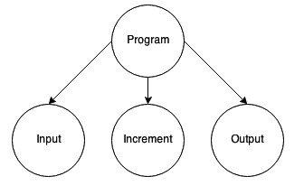
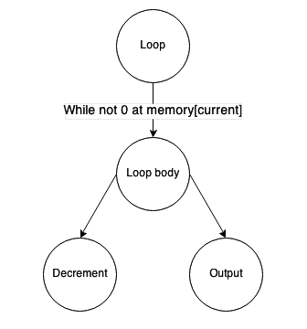
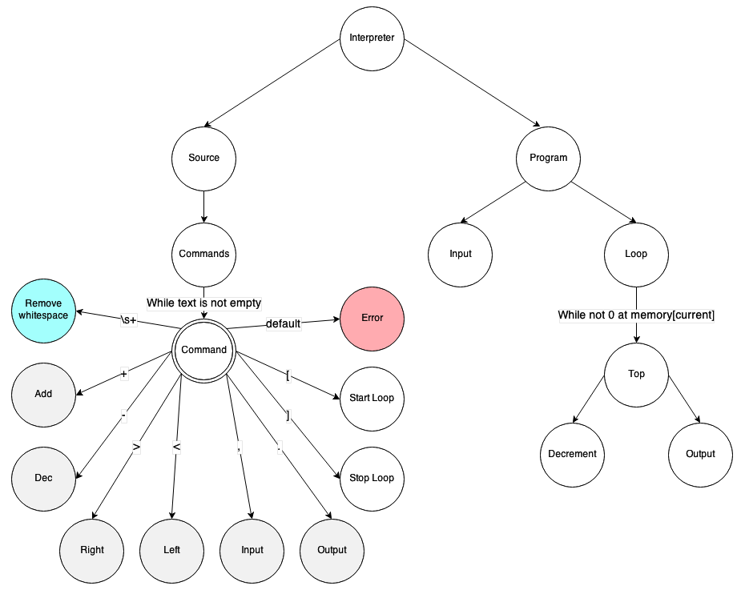

In Action
=========
Let's build the interpreter of Brainfuck_ language to demonstrate the application of Graph-talk.

The Language
------------
There are following commands:

#. '>'  move current memory pointer right.
#. '<' move memory pointer left.
#. '.' output current memory cell content.
#. ',' input data to the current memory cell.
#. '+' increase memory pointer value.
#. '–' decrease memory pointer value.
#. '[' start loop while current memory pointer is not 0, otherwise move to corresponding ']'.
#. ']' end loop.

This is pretty simple, though completely unreadable, and allows the modelling of complicated algorithms.

The Implementation
------------------
The idea is to build the graph of the parsed program and then run it. To do so, we need to put in the appropriate commands which will call corresponding Brainfuck 'virtual machine' methods. This is easy: just put the parsed commands to the complex notion to be executed one by one.

To build the loop, we will extract the portion of commands between '[' and ']' and run them separately while the condition is true. That means they need to be put under a separate complex notion, which in turn has to be inside the loop.

In general, we add the parsed commands to the current 'top' complex notion. When the parser encounters '[' it adds a loop and a new complex 'top' notion and preserves the previous one in the stack. When ']' is found, parser does pop from the stack.

The figure depicts the parsed graph of ",[-.]" program.
Simple commands, marked with the grey background just add VM call to the current top complex notion.
"Start loop" adds the new top, putting old one to the stack.
"Stop loop" pops the old top from the stack.
"Remove whitespace" notion removes whitespace by consuming it.
"Error" notion stops the process because an unknown character encountered. It is a default case for the "Command" selective notion.

When the parsing is over, the process continues to the program sub-graph and executes it.

.. _Brainfuck: http://en.wikipedia.org/wiki/Brainfuck